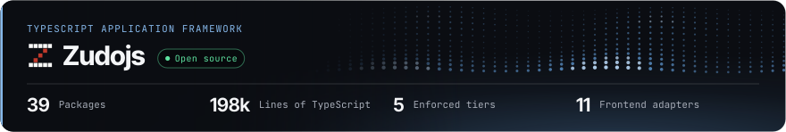
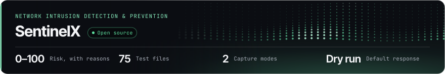
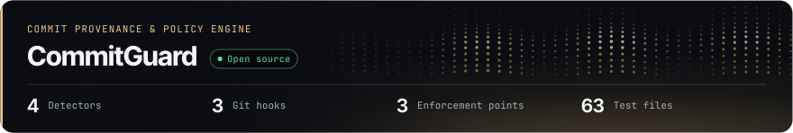
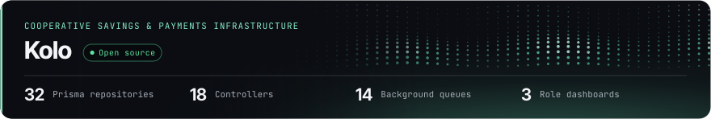
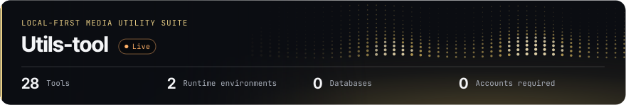
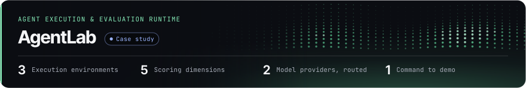
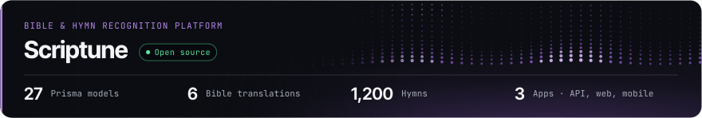
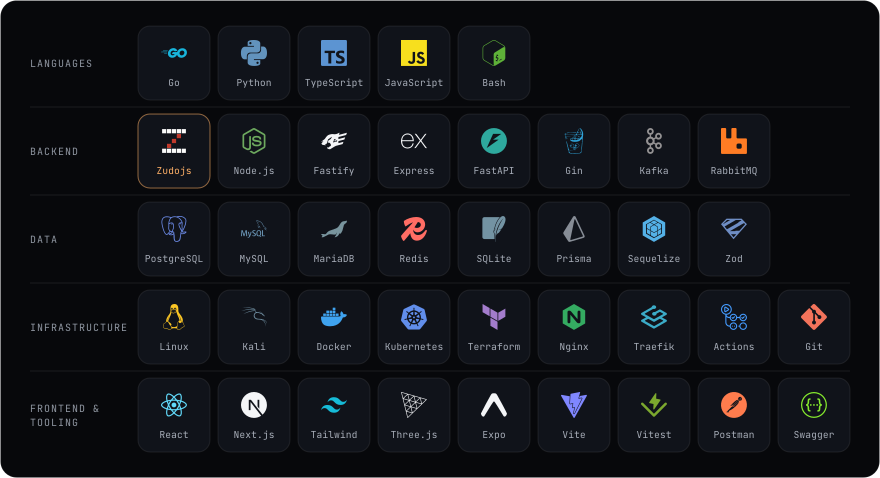
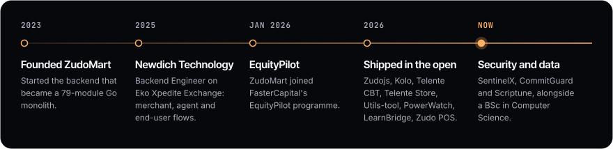

 

&nbsp;&nbsp;&nbsp;&nbsp;

 

## About me

I am a software engineer focused on backend development and systems engineering. I enjoy building the parts of software that users do not always see: APIs, databases, authentication, event-driven services, data pipelines, developer tools, and the architecture that connects them.

Most of what I have shipped serves Nigerian schools, shops, savings groups and traders. Those users have thin margins, slow networks and no patience for a product that almost works, which is a demanding teacher. It is why I care about where module boundaries go, what owns which data, what happens when a dependency is down, and how the next engineer finds their way around.

<table>
<tr><td width="170" valign="top"><b>Now</b></td><td>Founder & Lead Engineer at <b>ZudoMart</b> since 2023 · Backend Engineer at <b>Newdich Technology</b> since 2025</td></tr>
<tr><td width="170" valign="top"><b>Core languages</b></td><td>Go · Python · TypeScript</td></tr>
<tr><td width="170" valign="top"><b>Focus</b></td><td>Backend engineering · Python and data engineering · Distributed systems · Developer infrastructure</td></tr>
<tr><td width="170" valign="top"><b>Security</b></td><td>Not a separate job, a way of building: Argon2, TOTP, HMAC-verified webhooks, RBAC, rate limits that survive a restart, audit trails written before the first dispute</td></tr>
<tr><td width="170" valign="top"><b>Studying</b></td><td>BSc Computer Science at University of the People · ALX programmes completed</td></tr>
<tr><td width="170" valign="top"><b>Ask me about</b></td><td>Modular monoliths, CQRS and event spines, double-entry ledgers, escrow state machines, ent + Atlas, Fastify, FastAPI, and building a framework from the tiers up</td></tr>
</table>

 

## What I am building

Each banner carries the project's own colour and lattice from my portfolio, and four figures counted in its repository.

An Africa-first social commerce platform: marketplace, services, micro-gigs and live commerce behind a multi-layer trust engine. One Go deployable organised into 79 modules across five bounded domains, with CQRS over a Kafka event spine, ent schemas with Atlas migrations, money held as minor units, and a separate Python service for ranking, recommendation and fraud detection. Joined FasterCapital's EquityPilot programme in January 2026.

Go · chi · ent + Atlas · PostgreSQL · Redis · Kafka · Python · FastAPI · Kubernetes · Terraform 
[Case study](https://oyinlola1.vercel.app/work/zudomart)

 

A modular TypeScript framework I wrote and now build on: 39 packages on npm for DI, lifecycle, config, HTTP, events, CQRS, queues, tenancy and observability, each usable on its own. Five tiers with the dependency direction enforced by a build-time check, token-based DI with no decorator reflection, lifecycle as a real state machine, and 11 frontend adapters over the same contracts. Scriptune's API runs on it.

TypeScript · Node.js 24 · pnpm workspaces · Zod · Vitest · ESM · MIT 
[Documentation](https://zudojs.oyinlola.site) · [Source](https://github.com/oyinlola-tech/zudo) · [Case study](https://oyinlola1.vercel.app/work/zudojs)

 

An open-source network intrusion detection and prevention platform. It captures traffic live or from PCAP files, detects scans, brute force, floods, DNS abuse and custom rule matches, and scores every finding from 0 to 100 with the reasons shown. Related findings are correlated into incidents, and it only blocks through the host firewall when you switch that on, behind a safety guard.

Python · FastAPI · SQLAlchemy · PostgreSQL · Redis · Next.js · nftables · Prometheus · Apache-2.0 
[Source](https://github.com/oyinlola-tech/Sentinelx)

 

A Git commit provenance and contribution policy engine. Independent detectors report what a commit claims about its origin, and a separate policy layer decides what to do about it. Local hooks stop violations at commit and push, a GitHub Actions check and a webhook-driven GitHub App run the same engine on pull requests and merge queues, and a dashboard explains what was blocked and why.

Python · TypeScript · React · Vite · SQLite · GitHub Actions · MIT 
[Source](https://github.com/oyinlola-tech/commitguard)

 

Digital infrastructure for Ajo and Esusu cooperative savings groups. A double-entry ledger from the first commit, HMAC-verified Nomba webhooks that are re-verified out of band before any wallet is credited, one database transaction per settlement, and 14 BullMQ queues keeping payouts and reminders off the request path.

TypeScript · Fastify 5 · Prisma · PostgreSQL · Redis · BullMQ · React 19 · Nomba · Argon2 
[Source](https://github.com/oyinlola-tech/kolo-nomba) · [Case study](https://oyinlola1.vercel.app/work/kolo)

 

28 image, PDF, file and developer tools in one codebase that runs fully local or serverless. A capability system means the interface never offers a tool the server cannot run. Layered FastAPI backend, pluggable storage, magic-byte validation and decompression-bomb protection. No database, no accounts, no cloud uploads.

Python · FastAPI · Pillow · pikepdf · Ghostscript · rembg 
[Live](https://tools.oyinlola.site) · [Source](https://github.com/oyinlola-tech/utils-tools) · [Case study](https://oyinlola1.vercel.app/work/utils-tool)

 

A runtime that executes AI agents across browser, sandbox and desktop behind one interface, each with an offline mock so the whole system demos in a second with no API keys. Every claim in an answer cites the page it came from, a tool failure is a branch rather than an ending, and runs are scored on five weighted dimensions instead of by an LLM judge.

TypeScript · Node.js · Solari SDK · Gemini · Groq 
[Case study](https://oyinlola1.vercel.app/work/agentlab)

 

Recognition and discovery for the Bible and Christian hymns: hear a hymn or a passage, identify it, and see the words, the scripture and everything connected to it. A Zudojs modular-monolith API over PostgreSQL, a Next.js web app, an Expo mobile app, a shared contracts package, and a local Whisper transcriber so recognition never leaves the machine.

TypeScript · Zudojs · PostgreSQL · Redis · Next.js · Expo · Whisper 
[Source](https://github.com/oyinlola-tech/scriptune)

 

## More production work

Every number below was counted in the repository, not estimated. Projects whose repositories are private carry a case study instead of a source link.

| Project | What it is | Counted in the repository |
| --- | --- | --- |
| **Telente CBT** [Case study](https://oyinlola1.vercel.app/work/telente-cbt) | Multi-tenant computer-based testing platform with a service-key-isolated Python AI service for question generation TypeScript · Fastify · Prisma · PostgreSQL 16 · Redis · FastAPI | 47 Prisma models · 4 question types |
| **Telente Store** [Source](https://github.com/oyinlola-tech/Newdich-store) · [Case study](https://oyinlola1.vercel.app/work/telente-store) | Modular-monolith commerce platform: storefront, admin and API in one process TypeScript 5.9 · Fastify 5 · Prisma · MySQL · Paystack | 24 hexagonal modules · 150+ routes · 31 models |
| **Zudo POS** [Source](https://github.com/oyinlola-tech/Zudo-POS) · [Case study](https://oyinlola1.vercel.app/work/zudo-pos) | Multi-tenant point of sale with shifts, suppliers, purchase orders, loyalty and crypto settlement TypeScript · Fastify · Prisma · libSQL | 27 route modules · 19 models · 4 role portals |
| **LearnBridge** [Source](https://github.com/oyinlola-tech/LMS) · [Case study](https://oyinlola1.vercel.app/work/learnbridge) | Full LMS with four workspaces, realtime channels, Paystack billing and verifiable certificates TypeScript · Fastify · Prisma · PostgreSQL · Redis | 4 workspaces · 3 realtime channel types |
| **PowerWatch** [Case study](https://oyinlola1.vercel.app/work/powerwatch) | Crowd-sourced electricity outage tracking for Nigeria, built for the Orange internship programme TypeScript · Fastify · Prisma · MySQL · React · MapLibre | 20 Prisma models · 6 geographic levels |
| **Eko Xpedite Exchange** [Case study](https://oyinlola1.vercel.app/work/eko-xpedite) | Exchange and settlement backend with the Newdich team: merchant, agent and end-user flows Node.js · TypeScript · PostgreSQL · Docker | 3 actor models · team codebase |
| **IKALE** [Case study](https://oyinlola1.vercel.app/work/ikale) | Community membership backend built around account recovery that never reveals whether an account exists TypeScript · Fastify · Prisma · PostgreSQL · Zod | 357 commits · OTPs hashed at rest |
| **CH-RTV** [Source](https://github.com/oyinlola-tech/chrtv) · [Case study](https://oyinlola1.vercel.app/work/ch-rtv) | Carrier haulage visibility: a TCP gateway speaking the COBAN tracker protocol, geofencing and CMA-CGM integration Node.js · MySQL · TCP sockets · JWT · Swagger | 5 internal services · 16 route modules |
| **Aisle Commerce** [Source](https://github.com/oyinlola-tech/e-commmerce-saas) · [Case study](https://oyinlola1.vercel.app/work/aisle-commerce) | Multi-tenant storefront SaaS: twelve bounded-context services behind a gateway that signs every internal request Node.js · Express · MySQL · Redis · RabbitMQ · HMAC | 12 domain services · 8 domain events |
| **Gly VTU** [Source](https://github.com/oyinlola-tech/gly-vtu) · [Case study](https://oyinlola1.vercel.app/work/gly-vtu) | Wallet and bill payments: transfers, airtime and bills through VTpass, Flutterwave virtual cards, KYC tiers TypeScript · Node.js · Flutterwave · VTpass | 25 route modules · 69 pages |
| **MedExplain AI** [Source](https://github.com/oyinlola-tech/health-ai) · [Case study](https://oyinlola1.vercel.app/work/medexplain-ai) | Explains medical reports with Gemini grounded in MedlinePlus and PubMed, then routes to verified doctors JavaScript · Node.js · Gemini | 20 service modules · 22 migrations · RAG |
| **Rivvo** [Source](https://github.com/oyinlola-tech/rivvo) · [Case study](https://oyinlola1.vercel.app/work/rivvo) | Messaging and calling platform: direct and group chat, WebRTC voice and video, group key rotation, moderation React 18 · Express · MySQL · Socket.IO · WebRTC | 17 route groups · 21 pages |
| **Revive Roots** [Source](https://github.com/oyinlola-tech/revive-root-essentials) · [Case study](https://oyinlola1.vercel.app/work/revive-roots) | Storefront and back office for a wellness brand with Flutterwave payments and lifecycle email React · Express · Sequelize · MySQL · Flutterwave | 18 Sequelize models · 32 pages |
| **Authenticator Lab** [Source](https://github.com/oyinlola-tech/oauth) · [Case study](https://oyinlola1.vercel.app/work/authenticator-lab) | A deliberately layered TOTP enrolment and verification flow: verify before you persist a secret TypeScript · Fastify · speakeasy | 4 routes · 0 secrets stored unverified |
| **Soft Beans Palace** [Live](https://soft-beans.vercel.app) · [Source](https://github.com/oyinlola-tech/aunty) | Ordering experience for a Port Harcourt food business that hands checkout to WhatsApp Next.js · Tailwind · Zustand · Zod | 0 backend services · 1 source of truth for price |
| **Newdich Technology** [Live](https://newdich.vercel.app) · [Source](https://github.com/oyinlola-tech/newdich) | Thirty-page corporate site generated by Python: no framework, no npm, three colours total Python 3 · HTML · CSS | 30 pages · 0 npm dependencies |
| **Solari Cookbook** [Source](https://github.com/solari-sdk/solari-cookbook) · [Case study](https://oyinlola1.vercel.app/work/solari-cookbook) | Nine runnable SDK examples for cloud browsers, sandboxes and desktops, one idea each TypeScript · Python · Solari SDK | 9 examples · 2 languages |

All 26 case studies, including Telente Technologies, Telente Logistics, Telente School Management and Glossy Store, are on the [work index](https://oyinlola1.vercel.app/work).

<b>Earlier and smaller repositories</b>

 

| Repository | What it is | Links |
| --- | --- | --- |
| `cms` | Church management system for a parish in Okitipupa: public site plus an RBAC admin over Express and MySQL | [Source](https://github.com/oyinlola-tech/cms) |
| `Telente-logistic-Webapp` | Logistics booking and tracking web app | [Live](https://telente-logistic-webapp.vercel.app) · [Source](https://github.com/oyinlola-tech/Telente-logistic-Webapp) |
| `BrightLearn` | Learning platform front end for a tutoring brand | [Live](https://brightlearn-ten.vercel.app) · [Source](https://github.com/oyinlola-tech/BrightLearn) |
| `telente-chamber` | Law-firm practice management prototype, my first real product build | [Source](https://github.com/oyinlola-tech/telente-chamber) |
| `oyinlola` | The source of the portfolio: Next.js, an interactive shell, a procedural WebGL hero, a printable CV | [Live](https://oyinlola1.vercel.app) · [Source](https://github.com/oyinlola-tech/oyinlola) |
| `portfolio.io` | The hand-coded portfolio the current site replaced | [Live](https://portfolio-io-ashen.vercel.app) · [Source](https://github.com/oyinlola-tech/portfolio.io) |

 

 

## Engineering stack

Zudojs sits first in the backend row because I wrote it and build on it.

| Layer | What I reach for |
| --- | --- |
| Backend | Go with chi and Gin · Zudojs, Fastify 5 and Express on Node.js · FastAPI · REST and gRPC · OpenAPI and Swagger |
| Data access | ent + Atlas · sqlc and pgx · Prisma · Sequelize · PostgreSQL, MariaDB, MySQL, Redis, SQLite and libSQL |
| Architecture | Modular monolith · Microservices · Event-driven and CQRS · Hexagonal ports and adapters · DI containers · Multi-tenancy |
| Data engineering | Python pipelines · Event processing · Ranking and recommendation · Vector search · Analytics |
| Security | Argon2 · TOTP and 2FA · JWT and session design · RBAC · HMAC webhook verification · Rate limiting · Input validation |
| Operations | Linux and Bash · Docker and Kubernetes · Terraform · Traefik and Nginx · BullMQ · Kafka · CI/CD on GitHub Actions |

 

## How I structure a backend

The shape most of my systems take, drawn from ZudoMart. One deployable with real internal seams, a Python service where the models live, and an event spine so a domain can be extracted as a build change rather than a rewrite.

 

## Principles

<table>
<tr><td width="170" valign="top"><b>Boundaries before frameworks</b></td><td>Most systems fail at the seams, not in the middle. Draw module boundaries and type contracts first, then pick the framework that fits them.</td></tr>
<tr><td width="170" valign="top"><b>A monolith you can split</b></td><td>Every module owns its ports, adapters and data, so extraction is a build change rather than a rewrite.</td></tr>
<tr><td width="170" valign="top"><b>Understand it underneath</b></td><td>Rather than only using a framework, know how one should structure an application at all. That question is what Zudojs is.</td></tr>
<tr><td width="170" valign="top"><b>Ship the whole thing</b></td><td>An API without a storefront is a demo. Backend, dashboard, public site, payments, emails and deploy.</td></tr>
<tr><td width="170" valign="top"><b>Trust is an engineering problem</b></td><td>Escrow, verification, dispute windows and audit trails are state machines, not policy documents.</td></tr>
<tr><td width="170" valign="top"><b>Build for thin margins and slow networks</b></td><td>Small payloads, offline-tolerant flows, local payment rails, and no patience for a product that almost works.</td></tr>
</table>

 

 

## Journey

 

## Activity

Both images are drawn by workflows in this repository from public data, so nothing here depends on a third-party stats service.

 

<picture>
  <source media="(prefers-color-scheme: dark)" srcset="https://raw.githubusercontent.com/oyinlola-tech/oyinlola-tech/output/github-contribution-grid-snake-dark.svg" />
  <source media="(prefers-color-scheme: light)" srcset="https://raw.githubusercontent.com/oyinlola-tech/oyinlola-tech/output/github-contribution-grid-snake.svg" />
  
</picture>

 

## Connect

I am open to backend, platform and software engineering roles, and to conversations about any of the systems above.

&nbsp;&nbsp;&nbsp;&nbsp;

  

