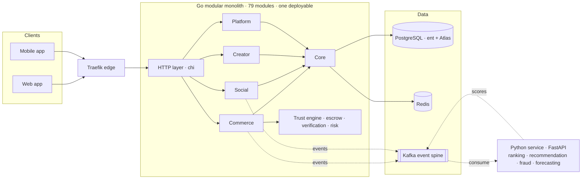

 

  

 

## About me

I build the systems behind useful products: backend APIs, data pipelines, developer tools, and the architecture that holds them together.

Most of what I have shipped serves Nigerian schools, shops, savings groups and traders. Those users have thin margins, slow networks and no patience for a product that almost works, which is a demanding teacher. It is why I care about where module boundaries go, what owns which data, what happens when a dependency is down, and how the next engineer finds their way around.

| | |
| --- | --- |
| **Now** | Founder & Lead Engineer at **ZudoMart** (2023 to present) · Backend Engineer at **Newdich Technology** (2025 to present) |
| **Core languages** | Go · Python · TypeScript |
| **Focus** | Backend engineering · Python & data engineering · Distributed systems · Developer infrastructure |
| **Security** | Not a separate job, a way of building: Argon2, TOTP, HMAC-verified webhooks, RBAC, persistent rate limits, audit trails before the first dispute |
| **Studying** | BSc Computer Science, University of the People · ALX software engineering programmes |
| **Ask me about** | Modular monoliths, CQRS and event spines, double-entry ledgers, escrow state machines, ent + Atlas, Fastify, FastAPI |

 

## What I am building

<table>
<tr>
<td width="50%" valign="top">

### 🛒 ZudoMart
**Social commerce super-app · Go modular monolith**

79 Go modules across five bounded domains in one deployable, with an escrow and three-tier verification trust engine, CQRS over a Kafka event spine, ent + Atlas migrations, money as minor units, and a separate Python service for ranking, recommendation and fraud detection. Joined FasterCapital's EquityPilot programme in January 2026.

`Go` `chi` `ent + Atlas` `PostgreSQL` `Redis` `Kafka` `Python` `FastAPI` `Kubernetes` `Terraform`

</td>
<td width="50%" valign="top">

### 🧩 Zudojs
**Modular TypeScript application framework · Open source**

39 independently published packages for DI, lifecycle, config, HTTP, events, CQRS, queues, tenancy and observability. Five tiers with the dependency direction enforced by a build-time check, token-based DI with no decorator reflection, lifecycle as a real state machine, and 11 frontend adapters over the same contracts.

`TypeScript` `Node.js` `pnpm workspaces` `Zod` `Vitest` `ESM`

</td>
</tr>
<tr>
<td width="50%" valign="top">

### 🛡️ SentinelX
**Network intrusion detection and prevention · Open source**

Captures traffic live or from PCAP, detects scans, brute force, floods, DNS abuse and custom rule matches, scores every finding from 0 to 100 with the reasons shown, correlates findings into incidents, and only blocks through the host firewall when you switch it on, behind a safety guard. Unit, integration, API, replay and kernel-namespace tests in CI.

`Python` `FastAPI` `SQLAlchemy` `PostgreSQL` `Redis` `Next.js` `nftables` `Prometheus`

</td>
<td width="50%" valign="top">

### ✅ CommitGuard
**Git commit provenance and policy engine · Open source**

Independent detectors report what a commit claims about its origin; a separate policy layer decides what to do about it. Local hooks stop violations at `git commit` and `git push`, a GitHub Actions check and a webhook-driven GitHub App run the same engine on pull requests and merge queues, and a dashboard explains what was blocked and why.

`Python` `TypeScript` `React` `Vite` `SQLite` `GitHub Actions`

</td>
</tr>
<tr>
<td width="50%" valign="top">

### 💰 Kolo
**Cooperative savings and payments infrastructure**

Digital rails for Ajo and Esusu savings groups. A double-entry ledger from the first commit, HMAC-verified Nomba webhooks re-verified out of band before any wallet is credited, one database transaction per settlement, and 14 BullMQ queues keeping payouts and reminders off the request path. 32 Prisma repositories, 18 controllers, three role dashboards.

`TypeScript` `Fastify 5` `Prisma` `PostgreSQL` `Redis` `BullMQ` `React 19` `Nomba`

</td>
<td width="50%" valign="top">

### 🧰 Utils-tool
**Local-first media utility suite · Live**

28 image, PDF, file and developer tools in one codebase that runs fully local or serverless. A capability system so the UI never offers a tool the server cannot run, a layered FastAPI backend with pluggable storage, magic-byte validation and decompression-bomb protection. No database, no accounts, no cloud uploads.

`Python` `FastAPI` `Pillow` `pikepdf` `Ghostscript` `rembg`

</td>
</tr>
<tr>
<td width="50%" valign="top">

### 🤖 AgentLab
**Agent execution and evaluation runtime**

Runs AI agents across browser, sandbox and desktop behind one interface, each with an offline mock so the whole system demos in a second with no API keys. Every claim in an answer cites the page it came from, tool failures are treated as a branch rather than an ending, and runs are scored across five weighted dimensions instead of an LLM judge.

`TypeScript` `Node.js` `Solari SDK` `Gemini` `Groq`

</td>
<td width="50%" valign="top">

### 🎼 Scriptune
**Recognition and discovery for the Bible and hymns**

Hear a hymn or a passage, identify it, and see the words, the scripture and everything connected to it. A Zudojs modular-monolith API over PostgreSQL, a Next.js web app, an Expo mobile app, a shared contracts package, and a local Whisper transcriber so recognition never leaves the machine.

`TypeScript` `Zudojs` `PostgreSQL` `Redis` `Next.js` `Expo` `Whisper`

</td>
</tr>
</table>

 

## More production work

Every number below was counted in the repository, not estimated. Projects whose repositories are private carry a case study instead of a source link.

| Project | What it is | Scale | Stack | Links |
| --- | --- | --- | --- | --- |
| **Telente CBT** | Multi-tenant computer-based testing platform with a service-key-isolated Python AI service for question generation | 47 Prisma models · 4 question types | TypeScript · Fastify · Prisma · PostgreSQL 16 · Redis · FastAPI | [Case study](https://oyinlola1.vercel.app/work/telente-cbt) |
| **Telente Store** | Modular-monolith commerce platform: storefront, admin and API in one process | 24 hexagonal modules · 150+ routes · 31 models | TypeScript 5.9 · Fastify 5 · Prisma · MySQL · Paystack | [Source](https://github.com/oyinlola-tech/Newdich-store) · [Case study](https://oyinlola1.vercel.app/work/telente-store) |
| **Zudo POS** | Multi-tenant point of sale with shifts, suppliers, purchase orders, loyalty and crypto settlement | 27 route modules · 19 models · 4 role portals | TypeScript · Fastify · Prisma · libSQL | [Source](https://github.com/oyinlola-tech/Zudo-POS) · [Case study](https://oyinlola1.vercel.app/work/zudo-pos) |
| **LearnBridge** | Full LMS with four workspaces, realtime channels, Paystack billing and verifiable certificates | 4 workspaces · 3 realtime channel types | TypeScript · Fastify · Prisma · PostgreSQL · Redis | [Source](https://github.com/oyinlola-tech/LMS) · [Case study](https://oyinlola1.vercel.app/work/learnbridge) |
| **PowerWatch** | Crowd-sourced electricity outage tracking for Nigeria, built for the Orange internship programme | 20 Prisma models · 6 geographic levels | TypeScript · Fastify · Prisma · MySQL · React · MapLibre | [Case study](https://oyinlola1.vercel.app/work/powerwatch) |
| **Eko Xpedite Exchange** | Exchange and settlement backend with the Newdich team: merchant, agent and end-user flows | 3 actor models · team codebase | Node.js · TypeScript · PostgreSQL · Docker | [Case study](https://oyinlola1.vercel.app/work/eko-xpedite) |
| **IKALE** | Community membership backend built around account recovery that never reveals whether an account exists | 357 commits · OTPs hashed at rest | TypeScript · Fastify · Prisma · PostgreSQL · Zod | [Case study](https://oyinlola1.vercel.app/work/ikale) |
| **CH-RTV** | Carrier haulage visibility: a TCP gateway speaking the COBAN tracker protocol, geofencing and CMA-CGM integration | 5 internal services · 16 route modules | Node.js · MySQL · TCP sockets · JWT · Swagger | [Source](https://github.com/oyinlola-tech/chrtv) · [Case study](https://oyinlola1.vercel.app/work/ch-rtv) |
| **Aisle Commerce** | Multi-tenant storefront SaaS: twelve bounded-context services behind a gateway that signs every internal request | 12 domain services · 8 domain events | Node.js · Express · MySQL · Redis · RabbitMQ · HMAC | [Source](https://github.com/oyinlola-tech/e-commmerce-saas) · [Case study](https://oyinlola1.vercel.app/work/aisle-commerce) |
| **Gly VTU** | Wallet and bill payments: transfers, airtime and bills through VTpass, Flutterwave virtual cards, KYC tiers | 25 route modules · 69 pages | TypeScript · Node.js · Flutterwave · VTpass | [Source](https://github.com/oyinlola-tech/gly-vtu) · [Case study](https://oyinlola1.vercel.app/work/gly-vtu) |
| **MedExplain AI** | Explains medical reports with Gemini grounded in MedlinePlus and PubMed, then routes to verified doctors | 20 service modules · 22 migrations · RAG | JavaScript · Node.js · Gemini | [Source](https://github.com/oyinlola-tech/health-ai) · [Case study](https://oyinlola1.vercel.app/work/medexplain-ai) |
| **Rivvo** | Messaging and calling platform: direct and group chat, WebRTC voice and video, group key rotation, moderation | 17 route groups · 21 pages | React 18 · Express · MySQL · Socket.IO · WebRTC | [Source](https://github.com/oyinlola-tech/rivvo) · [Case study](https://oyinlola1.vercel.app/work/rivvo) |
| **Revive Roots** | Storefront and back office for a wellness brand with Flutterwave payments and lifecycle email | 18 Sequelize models · 32 pages | React · Express · Sequelize · MySQL · Flutterwave | [Source](https://github.com/oyinlola-tech/revive-root-essentials) · [Case study](https://oyinlola1.vercel.app/work/revive-roots) |
| **Authenticator Lab** | A deliberately layered TOTP enrolment and verification flow: verify before you persist a secret | 4 routes · 0 secrets stored unverified | TypeScript · Fastify · speakeasy | [Source](https://github.com/oyinlola-tech/oauth) · [Case study](https://oyinlola1.vercel.app/work/authenticator-lab) |
| **Soft Beans Palace** | Ordering experience for a Port Harcourt food business that hands checkout to WhatsApp | 0 backend services · 1 source of truth for price | Next.js · Tailwind · Zustand · Zod | [Live](https://soft-beans.vercel.app) · [Source](https://github.com/oyinlola-tech/aunty) |
| **Newdich Technology** | Thirty-page corporate site generated by Python: no framework, no npm, three colours total | 30 pages · 0 npm dependencies | Python 3 · HTML · CSS | [Live](https://newdich.vercel.app) · [Source](https://github.com/oyinlola-tech/newdich) |
| **Solari Cookbook** | Nine runnable SDK examples for cloud browsers, sandboxes and desktops, one idea each | 9 examples · 2 languages | TypeScript · Python · Solari SDK | [Source](https://github.com/solari-sdk/solari-cookbook) · [Case study](https://oyinlola1.vercel.app/work/solari-cookbook) |

All 26 case studies, including Telente Technologies, Telente Logistics, Telente School Management and Glossy Store, are on the [work index](https://oyinlola1.vercel.app/work).

<b>Earlier and smaller repositories</b>

 

| Repository | What it is | Links |
| --- | --- | --- |
| `cms` | Church management system for a parish in Okitipupa: public site plus an RBAC admin over Express and MySQL | [Source](https://github.com/oyinlola-tech/cms) |
| `Telente-logistic-Webapp` | Logistics booking and tracking web app | [Live](https://telente-logistic-webapp.vercel.app) · [Source](https://github.com/oyinlola-tech/Telente-logistic-Webapp) |
| `BrightLearn` | Learning platform front end for a tutoring brand | [Live](https://brightlearn-ten.vercel.app) · [Source](https://github.com/oyinlola-tech/BrightLearn) |
| `telente-chamber` | Law-firm practice management prototype, my first real product build | [Source](https://github.com/oyinlola-tech/telente-chamber) |
| `oyinlola` | The source of the portfolio: Next.js, an interactive shell, a procedural WebGL hero, a printable CV | [Live](https://oyinlola1.vercel.app) · [Source](https://github.com/oyinlola-tech/oyinlola) |
| `portfolio.io` | The hand-coded portfolio the current site replaced | [Live](https://portfolio-io-ashen.vercel.app) · [Source](https://github.com/oyinlola-tech/portfolio.io) |

 

## Engineering stack

**Languages**

**Backend and messaging**

**Data**

**Infrastructure and security**

**Frontend and tooling**

| Layer | What I reach for |
| --- | --- |
| Backend | Go with chi and Gin · Fastify 5 and Express on Node.js · FastAPI · REST and gRPC · OpenAPI and Swagger |
| Data access | ent + Atlas · sqlc and pgx · Prisma · Sequelize · PostgreSQL, MariaDB, MySQL, Redis, SQLite and libSQL |
| Architecture | Modular monolith · Microservices · Event-driven and CQRS · Hexagonal ports and adapters · DI containers · Multi-tenancy |
| Data engineering | Python pipelines · Event processing · Ranking and recommendation · Vector search · Analytics |
| Security | Argon2 · TOTP and 2FA · JWT and session design · RBAC · HMAC webhook verification · Rate limiting · Input validation |
| Operations | Linux and Bash · Docker and Kubernetes · Terraform · Traefik and Nginx · BullMQ · Kafka · CI/CD on GitHub Actions |

 

## How I structure a backend

The shape most of my systems take, drawn from ZudoMart. One deployable with real internal seams, a Python service where models live, and an event spine so a domain can be extracted as a build change rather than a rewrite.

 

## Principles

| | |
| --- | --- |
| **Boundaries before frameworks** | Most systems fail at the seams, not in the middle. Draw module boundaries and type contracts first, then pick the framework that fits them. |
| **A monolith you can split** | Every module owns its ports, adapters and data, so extraction is a build change rather than a rewrite. |
| **Understand it underneath** | Rather than only using a framework, know how one should structure an application at all. That question is what Zudojs is. |
| **Ship the whole thing** | An API without a storefront is a demo. Backend, dashboard, public site, payments, emails and deploy. |
| **Trust is an engineering problem** | Escrow, verification, dispute windows and audit trails are state machines, not policy documents. |
| **Build for thin margins and slow networks** | Small payloads, offline-tolerant flows, local payment rails, and no patience for a product that almost works. |

 

## Journey

| When | What |
| --- | --- |
| 2023 | Founded **ZudoMart** and started the backend that became a 79-module Go monolith |
| 2025 | Joined **Newdich Technology** as a Backend Engineer on Eko Xpedite Exchange |
| Jan 2026 | ZudoMart joined FasterCapital's **EquityPilot** programme |
| 2026 | Shipped **Zudojs** (39 packages), **Kolo**, **Telente CBT**, **Telente Store**, **Utils-tool**, **PowerWatch**, **LearnBridge** and **Zudo POS** |
| Now | **SentinelX**, **CommitGuard** and **Scriptune** in the open, alongside a BSc in Computer Science and a deliberate move into Python and data engineering |

 

## Activity

  

  

<picture>
  <source media="(prefers-color-scheme: dark)" srcset="https://raw.githubusercontent.com/oyinlola-tech/oyinlola-tech/output/github-contribution-grid-snake-dark.svg" />
  <source media="(prefers-color-scheme: light)" srcset="https://raw.githubusercontent.com/oyinlola-tech/oyinlola-tech/output/github-contribution-grid-snake.svg" />
  
</picture>

 

## Connect

I am open to backend, platform and software engineering roles, and to conversations about the systems above.

  

